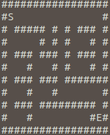

# MAGOS

## Description

MAGOS is a maze generator and solver.

### TODO

- [ ] Generators
  - [x] Binary Tree Algorithm;
  - [ ] Aldous-Broder Algorithm;
  - [ ] Recursive Backtracker;
  - [ ] Hunt and Kill Algorithm;
  - [ ] Sidewinder Algorithm;
  - [ ] Kruskal's Algorithm;
  - [ ] Growing Tree Algorithm;
  - [ ] Recursive Division;
  - [ ] Prim's Algorithm;
  - [ ] Wilson's Algorithm;
  - [ ] Eller's Algorithm.
- [ ] Solvers
  - [ ] Depth-First Search;
  - [ ] Wall follower.

## Compile and Run

Requirements:

- C++11
- CMake 3.1

To compile the project, go to the root and, through terminal, run the following commands:

```
mkdir build
cd build
cmake ..
```

Then, type the following command to run MAGOS:

```
./MAGOS <width> <height>
```

### Sample

<div style="margin: 0 auto; max-width: 250px;">
	<p align="center">
		
	</p>
</div>

## Author

[](https://github.com/brenov) |
---|
[Breno Viana](https://github.com/brenov) |
